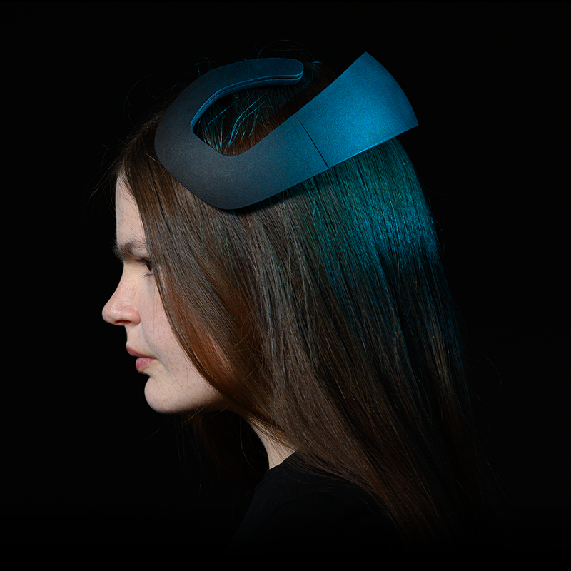

# Notion Client API by Neurosity

<p align="center">
  
</p>
<p align="center" href="">
  Provide a stable and powerful interface for Notion
</p>

First and foremost, Welcome! :tada: Willkommen! :confetti_ball: Bienvenue! :balloon::balloon::balloon:

Thank you for visiting the NotionJS repository.

This document (the README file) is a hub to give you some information about the project. Jump straight to one of the sections below, or just scroll down to find out more.

* [What are we doing? (And why?)](#what-are-we-doing)
* [Who are we?](#who-are-we)
* [What do we need?](#what-do-we-need)
* [How can you get involved?](#get-involved)
* [Get in touch](#contact-us)
* [Find out more](#find-out-more)
* [Installing](#installing)

## What are we doing?

### The problem

* People want to use an API instead of working with raw data
* People want to integrate Notion into client and serverside applications
* People don't want un authorized access to their data
* Time syncronization is important between client and Notion
* Notion should be able to support thousands of authorized viewers

So, there are a lot of wants be developers but there is still a lot of work needed to solve these problems.

### The solution

The NotionJS API will:

* Universal JavaScript support: Node/Browser/Electron
* Firebase + Custom Metric Subscriber
* Event-driven multi-client real-time architecture

Using NotionJS allows you, the user, to quickly integrate Notion so you can begin investing in yourself by hacking your life.

## Who are we?

Mainly, we are Neurosity. [Alex Castillo][link_alex_twitter] is the primary Author of NotionJS. We seek to open source the API portion of Notion such that the community at large can begin to improve the interface between applications and Notion. If we can write applications better, then the world improves.

## What do we need?

**You**! In whatever way you can help.

We need expertise in programming, user experience, software sustainability, documentation and technical writing and project management.

We'd love your feedback along the way.

Our primary goal is to provide a stable and powerful interface for Notion, and we're excited to support the professional development of any and all of our contributors. If you're looking to learn to code, try out working collaboratively, or translate you skills to the digital domain, we're here to help.

## Get involved

If you think you can help in any of the areas listed above (and we bet you can) or in any of the many areas that we haven't yet thought of (and here we're *sure* you can) then please check out our [contributors' guidelines](CONTRIBUTING.md) and our [roadmap](ROADMAP.md).

Please note that it's very important to us that we maintain a positive and supportive environment for everyone who wants to participate. When you join us we ask that you follow our [code of conduct](CODE_OF_CONDUCT.md) in all interactions both on and offline.


## Contact us

If you want to report a problem or suggest an enhancement, we'd love for you to [open an issue](../../issues) at this github repository so we can get right on it!

## Find out more

You might be interested in:

* Buy a [Notion][link_notion_buy] from [Neurosity][link_neurosity].

And of course, you'll want to know our:

* [Contributors' guidelines](CONTRIBUTING.md)
* [Roadmap](ROADMAP.md)

## Thank you

Thank you so much (Danke schön! Merci beaucoup!) for visiting the project and we do hope that you'll join us on this amazing journey to provide a stable and powerful interface for Notion.

## Welcome!

> This is a private (soon to be public) module published on npm. Ensure the npm user has access to the neurosity npm org before installing/publishing.

## Getting started

```bash
npm install @neurosity/notion
```

Then import the module

##### ESM

```js
import { Notion } from "@neurosity/notion";
```

##### Node

```js
const { Notion } = require("@neurosity/notion");
```

##### Browser

```html
<script type="module">
  import { Notion } from "./node_modules/notion/esm/notion.mjs";
</script>
<script nomodule src="./node_modules/notion/browser/notion.js">
```

## Examples

### Basic

Utilizes Firebase client for data transport.

```js
const notion = new Notion({
  deviceId: "****"
});
```

Options:

```ts
interface IOptions {
  deviceId: string;
}
```

## Metrics

- Calm
- Focus
- Kinesis
- Device
  - Info
  - Settings
  - Status
- Channel Aalysis
- Training
- Brainwaves
  - Raw
  - Power by Band
  - Frequency
  - PSD

### Basic examples

```js
import { Notion } from "@neurosity/notion";

const notion = new Notion();
```

##### Methods

- connect()
- disconnect()
- async getInfo()

#### Calm

Constantly fires and predicts user's calm level from passive cognitive state. Calm is based on the Alpha brainwave. There is a lot of research that shows a correlation between alpha and meditation/relaxtion.

```js
const mind = new Notion();

mind.calm().subscribe(calm => {
  console.log(calm);
});

// { probability: 0.34, metric: "awareness", label: "calm", timestamp:  1569961321101 }
// { probability: 0.41, metric: "awareness", label: "calm", timestamp:  1569961321105 }
// { probability: 0.45, metric: "awareness", label: "calm", timestamp:  1569961321110 }

// Demo
mind.calm().subscribe(({ probability }) => {
  if (probability < 0.25) {
    musicPlayer.recommendGenre("classical");
  }
});
```

#### Focus

Constantly fires and predicts user's focus level from passive cognitive state.

```js
const mind = new Notion();

mind.focus().subscribe(focus => {
  console.log(focus);
});

// { probability: 0.51, metric: "awareness", label: "focus", timestamp:  1569961321102 }
// { probability: 0.56, metric: "awareness", label: "focus", timestamp:  1569961321106 }
// { probability: 0.62, metric: "awareness", label: "focus", timestamp:  1569961321111 }

// Demo
mind.focus().subscribe(({ probability }) => {
  if (probability > 0.75) {
    notifications.off();
  }
});
```

#### Kinesis

The Kinesis API is based on the Motor Imagery BCI method. Fires when a user attempts to trigger a side effect from defined thoughts. E.g. motor imagery, etc.

```js
const mind = new Notion();

mind.kinesis("rightHand").subscribe(intent => {
  // Switch light off/on
  light.togglePower();
  console.log(intent);
});

// { probability: 0.93, label: "rightHand", timestamp: 1569961321174, metric: "kinesis"

mind.kinesis("liftHand").subscribe(intent => {
  // Launch drone
  drone.launch();
  console.log(intent);
});

// { probability: 0.92, label: "liftHand", timestamp: 1569961321191, type: "kinesis"  }
```

### Device / Info

Non-mutable device information.

##### Metrics:

```js
interface IInfo {
  deviceId: string;
  channels: number;
  channelNames: Array<string>;
  samplingRate: number;
  manufacturer: string;
  model: string;
  osVersion: string;
  apiVersion: string;
}
```

```js
import { Notion } from "@neurosity/notion";

const notion = new Notion();

const info = await notion.getInfo();
console.log(info); // { channels: 8, samplingRate: 250, ... }
```

### Device / Status

##### Metrics:

- battery: Number
- charging: Boolean
- connected: Boolean
- powered: Boolean
- updating: Boolean

```js
import { Notion } from "@neurosity/notion";

const notion = new Notion();

notion.status().subscribe(status => {
  console.log(status); // status example: { connected: true, powered: true, ... }
});
```

### Device / Settings

##### Methods:

```
- settings(): => Observable<Settings>
- changeSettings(settings: ChangeSettings): Promise<void>
```

```js
import { Notion } from "@neurosity/notion";

const notion = new Notion();

notion.settings().subscribe(settings => {
  console.log(settings);
  // { lsl: false }
  // { lsl: true }
});

await notion.changeSettings({
  lsl: true
});
```

### Channel analysis

```js
import { Notion } from "@neurosity/notion";

const notion = new Notion();

notion.channelAnalysis().subscribe(channelAnalysis => {
  console.log(channelAnalysis); // channel analysis: { FC1: 1, FC2: 0, FC3: -1, FC4: 1, ... }
});
```

#### Training

Options

```ts
interface ITraining {
  metric: string;
  label: string;
  duration: Date; // milliseconds
  fit?: boolean = false;
  timestamp?: Date;
}
```

Example

```js
const mind = new Notion();

mind.training.record({
  metric: "kinesis",
  label: "rightHand",
  duration: 5000
});
```

#### Brainwaves

##### Metrics:

- raw
- powerByBand
- frequency
- psd

```js
const mind = new Notion();

mind.brainwaves().subscribe(brainwaves => {
  console.log(brainwaves);
  /* 
  {
    data: [Number, ... , Number],
    timestamp: Date,
    frequency: [
      [Number, ... , Number]
    ],
    psd: [Number, ... , Number]
  }
  */
});
```

Optionally, metrics can be filtered by adding their comma-separated names.

```js
brainwaves("frequency").subscribe(brainwaves => {
  console.log(brainwaves);
  /* 
  { frequency: [
      [Number, ... , Number]
    ]
  }
  */
});
```

### Clients

Supported clients include

- Firebase
- (Custom Subscriber e.i. Websocket instance)

Clients should be classes with the following interface.

```ts
export interface IClient {
  actions: IActions;
  connect(callback?: Function): Promise<any>;
  disconnect(callback?: Function): Promise<any>;
  getInfo(): Promise<any>;
  metrics: IMetrics;
}
```

## Skills

Skills are applications that can be written and deployed to a Notion device.

A Skill is an npm package with:

- index.js
- package.json

For example:

./index.js

```js
const { createSkill } = require("@neurosity/notion");

module.exports = createSkill((notion, context) => {
  notion.kinesis().subscribe(kinesis => {
    console.log(kinesis);
  });

  return async () => {
    // Any additional clean-up here
  };
});
```

Note the Skill has to be exported as default.

./package.json

```json
{
  "name": "mind-drone",
  "version": "1.0.0",
  "description": "Notion-powered drone control",
  "dependencies": {
    "@neurosity/notion": "^1.0.0"
  },
  "engines": {
    "node": "10"
  },
  "private": true
}
```

## Releases

Please use [semver](https://docs.npmjs.com/misc/semver)

```
$ npm version (major|minor|patch)
$ npm push origin master
$ npm publish
```

## Examples

Requirements to run examples:

- Create `.env` file in root directory and add:
- NEUROSITY_DEVICE_ID=**deviceId**
- NEUROSITY_EMAIL=**email**
- NEUROSITY_PASSOWRD=**password**

### Browser

Builds browser examples and serves examples in the browser with ES modules.

```bash
npm run examples:browser
```

Go to: [http://localhost:3000](http://localhost:3000)

### Node

```bash
npm run examples:node
```

## TODOs

- Security audit
- Document how to get `deviceId`
- Publish to cdn

[link_ts_doc_base_url]: file:///Users/aj/Neurosity/notion-js/docs/
[link_ts_brainwaves]: classes/notion.html#brainwaves
[link_alex_twitter]: https://twitter.com/castillo__io
[link_aj_twitter]: https://twitter.com/andrewjaykeller
[link_neurosity]: https://neurosity.co
[link_notion_buy]: https://neurosity.co/developer-kit