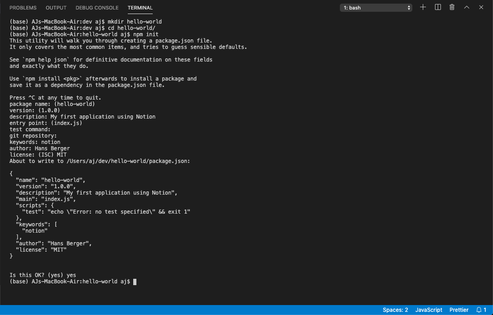
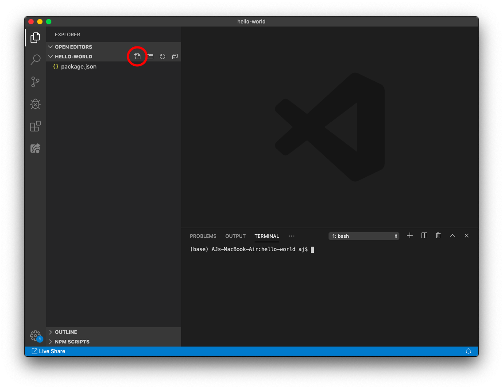
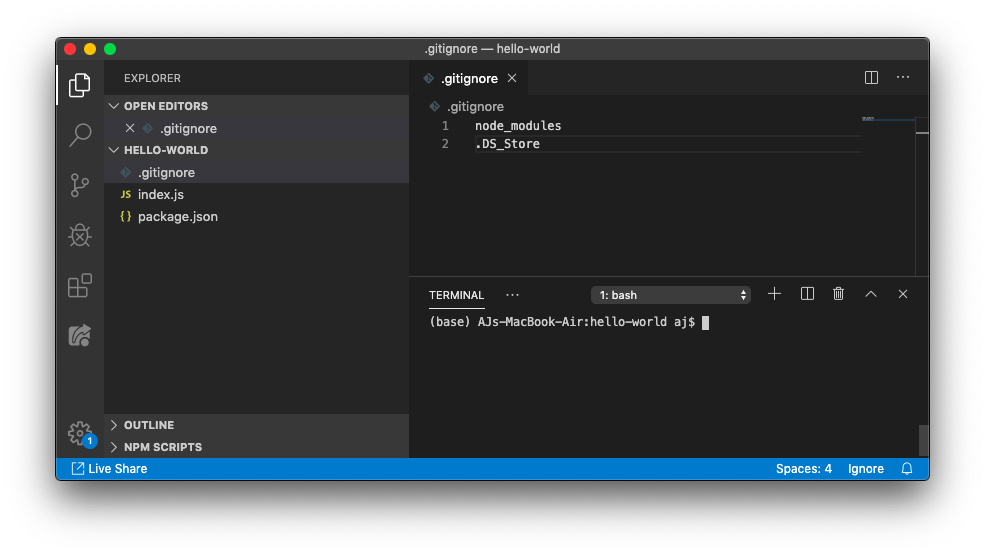
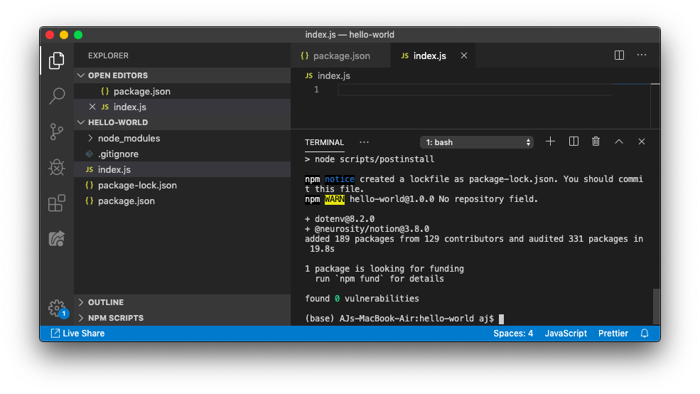
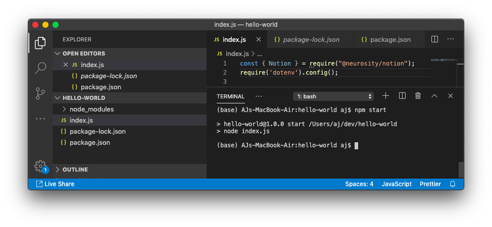
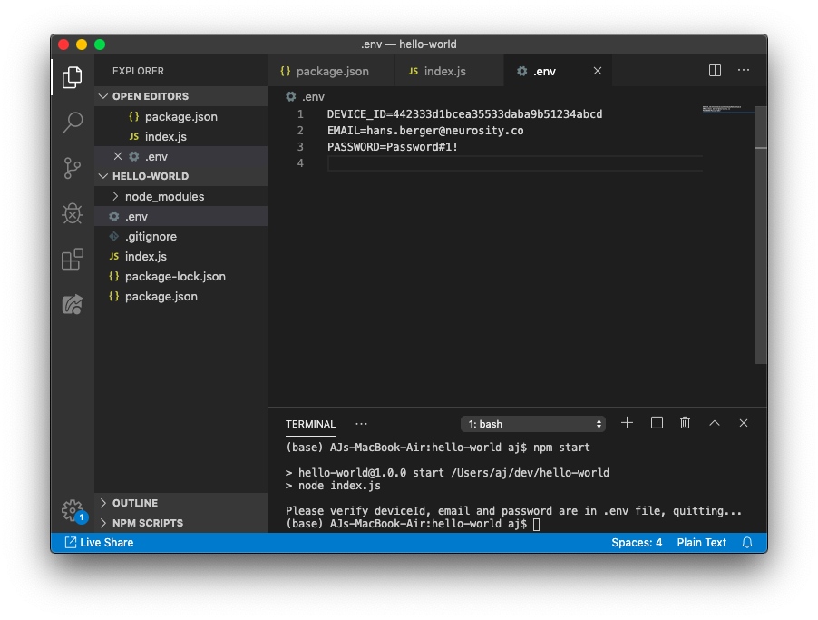
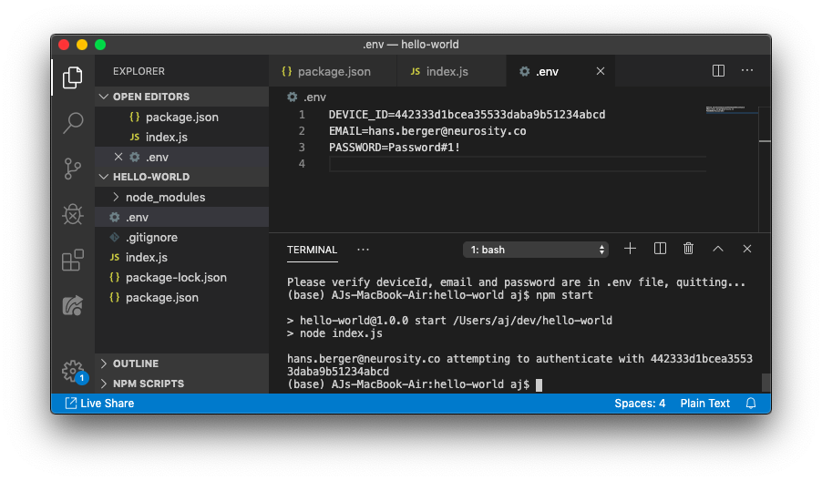
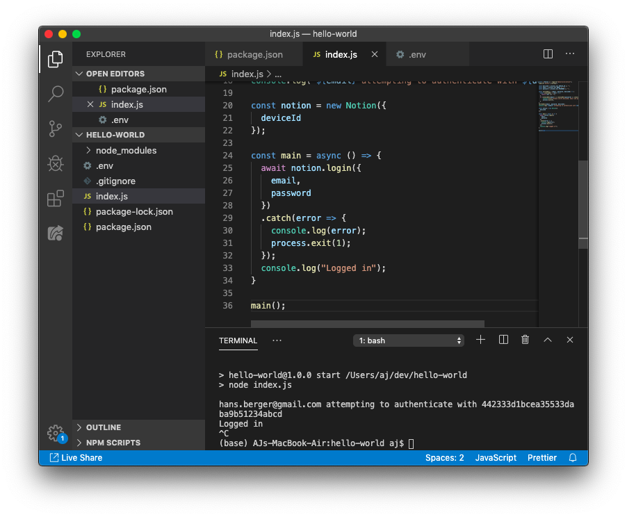

Welcome to Neurosity's NotionJS repository. To begin, you'll need to set up an account one time with Neurosity via [console.neurosity.co](consle.neurosity.co). Learn how to [create an account with Neurosity Developer Console](https://support.neurosity.co/hc/en-us/articles/360036196792).

## Prerequisites

To download the necessary tools, clone the repository, and install dependencies via `npm`, you need network access. 

### NPM

You'll need the following tools:

- [Git](https://git-scm.com)
- [Node.JS](https://nodejs.org/en/)
- [NPM](https://npmjs.org), use a [package manager](https://nodejs.org/en/download/package-manager/) to install.

Install and build all of the dependencies using [`NPM`](https://npmjs.org)

### VSCode

We'll be using [VSCode](https://code.visualstudio.com/download) to program this tutorial and our extension with powered by Notion. Check out our guide to [installing and getting started with VSCode and the Notion extension](https://support.neurosity.co/hc/en-us/articles/360036195712-Installing-and-using-the-VSCode-extension).

### Tutorial Repository

Want to see the complete project befor reading anymore? You can view all the code from this project in it's [repository on Github](https://github.com/neurosity/app-hello-world-notion-js).

## Setup your Project

### Hello World Folder

Create a new folder called `hello-world`

```bash
mkdir hello-world
```

Enter into the directory and initialize the `npm` project.

```bash
cd hello-world
npm init
```

You'll need to run through the initial questions:
```bash
package name: (hello-world) 
version: (1.0.0) 
description: My first application using Notion
entry point: (index.js) 
test command: 
git repository: 
keywords: notion
author: Hans Berger
license: (ISC) MIT
```

<p align="center">
  
</p>

Next you'll want to launch a VSCode window for the newly created project.

```bash
code .
```

### Working in VSCode

You'll need to launch a terminal window inside VS Code, you may toggle the terminal with `CTRL+~`.

<p align="center">
  
</p>

To create a new file, you may select the new file button.

<p align="center">
  
</p>

Go ahead and make a new file called `index.js`, we'll use it soon as the base of our new project.

<p align="center">
  
</p>

## Adding Notion to a Node Project

### Add `.gitignore` file

The first thing we want to do is add a file called `.gitignore` to tell git to ignore certain files. Add another file to the root directory called `.gitignore`, then add the following:

```
node_modules
.DS_Store
```

<p align="center">
  
</p>

Adding `node_modules` will help VS Code run a little bit better because we're telling it that we don't need to track anything in that folder.

### Install Dependencies

The first dependency we need to install is from Neurosity, it's called Notion. We'll end up using some environment variables from a `.env` file, so go ahead and install another dependency for that as well. From the command line, enter:

```bash
npm install @neurosity/notion dotenv
```

<p align="center">
  
</p>

### Add Dependencies to `index.js`

Importing libraries in Node is quite simple, all you have to do is add the following to the top of your index.js file:

```js
const { Notion } = require("@neurosity/notion");
require('dotenv').config();
```

<p align="center">
  
</p>

### Add start script to package.json

Now head over to the file called `package.json`. The `package.json` is at the core of every Node package. **Ignore the file called `package-lock.json`, it's automatically generated.** 

Find the section called `"scripts"` and add a property called `"start"` that will start the node process:

```json
"start": "node index.js"
```

Your `package.json` will look like below once added:

```json
{
  "name": "hello-world",
  "version": "1.0.0",
  "description": "My first application using Notion",
  "main": "index.js",
  "scripts": {
    "start": "node index.js",
    "test": "echo \"Error: no test specified\" && exit 1"
  },
  "keywords": [
    "notion"
  ],
  "author": "Hans Berger",
  "license": "MIT",
  "dependencies": {
    "@neurosity/notion": "^3.8.0",
    "dotenv": "^8.2.0"
  }
}
```

### Run the project from the CLI

Navigate back to the terminal and run `npm start` to make sure the project runs with out any errors.

```bash
npm start
```

You should see the program run and exit successfully

<p align="center">
  
</p>

## Add Authentication

At this point you will need to have [created an account](https://support.neurosity.co/hc/en-us/articles/360036196792-Create-account-with-Neurosity) with [console.neurosity.co](https://console.neurosity.co) and [claimed your Notion](https://support.neurosity.co/hc/en-us/articles/360037562351).

### Get variables from `.env` file

We'll first attempt to get our environment variables to show what happens when they are not there at runtime. Add the following code to pull the deviceId, email and password from the enviroment variables:

```js
const deviceId = process.env.DEVICE_ID || "";
const email = process.env.EMAIL || "";
const password = process.env.PASSWORD || "";
```

To verify that the variables are not blank, we could add a function to check for that and quit the program if so. Add the following function to your program next:

```js
const verifyEnvs = (email, password, deviceId) => {
  const invalidEnv = (env) => {
    return (env === "" || env === 0);
  }
  if (invalidEnv(email) || invalidEnv(password) || invalidEnv(deviceId)) {
      console.error("Please verify deviceId, email and password are in .env file, quitting...");
      process.exit(0);
  }
}
verifyEnvs(email, password, deviceId);

console.log(`${email} attempting to authenticate to ${deviceId}`);
```

Now if we run our program, we should see an error print out! Run with `npm start` from the CLI.

<p align="center">
  
</p>

### Add `.env` file

Next we'll add an `.env` to store our deviceId, login, and password. Add a new file called `.env` and add your deviceId, email and password. Learn how to [find your device ID](https://support.neurosity.co/hc/en-us/articles/360037198152-Get-Notion-Device-ID).

```.env
DEVICE_ID=442333d1bcea35533daba9b51234abcd
EMAIL=hans.berger@neurosity.co
PASSWORD=Password#1!
```

<p align="center">
  
</p>

Now if we run our program, we should see a success message print out, informing us that our variables have been extracted successfully.

<p align="center">
  
</p>

### Instantiate a Notion Session

We can then use the `deviceId` to instantiate a new Notion session by adding the following line to our file.

```js
const notion = new Notion({
  deviceId
});
```

### Add async login

We need to use an [`async/await`](https://javascript.info/async-await) paradigm for authenticating to the device. Go ahead and create an async functinon called `main` to the `index.js` file.

```js
const main = async () => {
  await notion.login({
    email,
    password
  })
  .catch(error => {
    console.log(error);
    process.exit(1);
  });
  console.log("Logged in");
}

main();
```

Then run the program with `npm start` in the CLI. If all worked, then you should see:

<p align="center">
  
</p>

## Dive right into development

You'll want to [learn how to authenticate](/docs/api/authentication) with Notion next using your [console.neurosity.co](console.neurosity.co) login.

If you're looking for exact API references, check out the [API section](/docs/ref/index) of these docs!